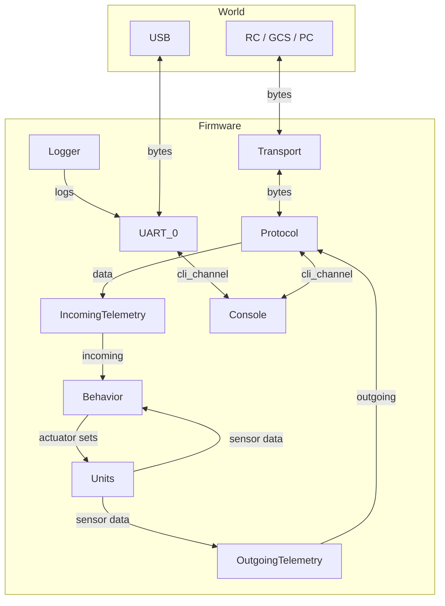

# Botix: ESP32 Mobile Robot Firmware

**Botix-esp32** is a modular, C++20 firmware for ESP32‑based mobile robots. It provides a flexible bridge between low‑level hardware (motors, encoders, lidar, servos) and high‑level controllers (ROS 2, PC applications) via configurable transports and protocols.

This firmware is part of the [Botix monorepo](https://github.com/KiraFlux/botix) and lives in `botix-esp32/`. 
Firmware is a **PlatformIO** project. All dependencies declared and managed in [`platformio.ini`](./platformio.ini)

| Feature                      | Description                                                                                                          |
| :--------------------------- | :------------------------------------------------------------------------------------------------------------------- |
| **CLI**                      | Interactive serial console with command groups, help, argument parsing (integers, floats, booleans, strings, enums). |
| **Persistent configuration** | Stored in ESP32 NVS, with CRC and deferred sync; two config sets: *Device* (hardware) and *User* (network/boot).     |
| **Drivers**                  | For motors (DRV8871), servos (MG90S), quadrature encoders, and LD_06 LIDAR.                                          |
| **Protocols**                | RAW (byte‑stream) and MAVLink v2 (heartbeat, manual_control, wheel/obstacle distance, serial_control).               |
| **Transports**               | ESP‑NOW (low‑latency peer‑to‑peer) and WiFi UDP (mDNS discovery).                                                    |
| **Units**                    | Logical hardware groups (wheel motors, servos, encoders, lidar) with `init/quit/state`.                              |
| **Behaviors**                | Operational behavior with tank/direct drive modes and input timeout.                                                 |
| **System services**          | Config, mixer, WiFi.                                                                                                 |

> Firmware work in progress. Please check [current feature limitations](#feature-limitations) first.

---

## Quick Start

### Prerequisites

- PlatformIO Core
- Robot with ESP32 development board

### Build & Upload

```bash
make                # build the firmware (esp32dev environment)
make upload         # compile and upload
make monitor        # open serial monitor (115200 baud)
make clean          # clean artifacts
```

> The `make` commands use the Makefile located in the firmware folder, which includes common targets from the KiraFlux Toolkit. PlatformIO Core must be installed and available in your `PATH`.

### Native Examples

Some examples can be run natively (x86) for testing:

```bash
pio test -e native          # run unit tests (if any)
pio run -e native -t upload # run a specific example
```

Examples in `examples/`:
- `core/cli` - CLI console creation and command registration.
- `core/config-registry` - using the config registry with a custom struct.
- `driver/lidar` - basic LIDAR reading and sector averaging.

---

## CLI - Full Command Reference

The CLI is the primary interface for interaction. Commands are grouped by system.
Use `help` to discover commands and `help <command>` for detailed usage.

| Group         | Command      | Arguments        | Description                                                                    |
| :------------ | :----------- | :--------------- | :----------------------------------------------------------------------------- |
| **global**    | `help`       | `[target]`       | Show help for a command or group.                                              |
| **config**    | `list`       | `[path_hint]`    | List all config fields (filter by substring).                                  |
|               | `field`      | `<path> [value]` | Get or set a config field (if `value` omitted, prints current value).          |
|               | `sync`       | `<device\|user>` | Force sync the specified config set with NVS (load/save).                      |
|               | `reset`      | `<device\|user>` | Reset the specified config set to defaults.                                    |
| **transport** | `status`     | -                | Show current transport and active address (if connected).                      |
|               | `use`        | `<espnow\|wifi>` | Switch the active transport.                                                   |
|               | `connect`    | -                | Establish a connection (for WiFi, uses the preset remote address).             |
|               | `disconnect` | -                | Drop the current connection.                                                   |
| **unit**      | `list`       | -                | List all registered units with their states (`idle/running/failed/suspended`). |
|               | `init`       | `<kind> <index>` | Initialize a unit (e.g., `init wheel_motor 0`).                                |
|               | `quit`       | `<kind> <index>` | Quit (stop) a unit.                                                            |
|               | `state`      | `<kind> <index>` | Show the state of a specific unit.                                             |
| **protocol**  | `set`        | `<raw\|mavlink>` | Select the active protocol.                                                    |

> **Syntax:** arguments in `<>` are required; `[]` are optional. Paths are the full registry keys (e.g., `mixer.mode`).

---

## Configuration - Full Registry Field List

All configurable parameters are exposed through the config registry and persisted in NVS.  
The table below lists every field, its type (`u8`, `i16`, `bool`, `IPv4`, etc.), default value, and description.

| Key                                    | Type                 | Default   | Description                                                 |
| :------------------------------------- | :------------------- | :-------- | :---------------------------------------------------------- |
| **WiFi**                               |                      |           |                                                             |
| `hostname`                             | `char[32]`           | `"botix"` | mDNS hostname (reachable as `<hostname>.local`).            |
| `wifi.enabled`                         | `bool`               | `false`   | Enable WiFi station mode.                                   |
| `wifi.ssid`                            | `char[32]`           | `""`      | SSID of the access point.                                   |
| `wifi.password`                        | `char[32]`           | `""`      | Password (empty = open network).                            |
| **Boot**                               |                      |           |                                                             |
| `boot.transport`                       | `enum (espnow/wifi)` | `wifi`    | Transport used at startup.                                  |
| `boot.protocol`                        | `enum (raw/mavlink)` | `mavlink` | Protocol used at startup.                                   |
| `boot.init_lidar`                      | `bool`               | `false`   | Auto‑initialize LIDAR on boot.                              |
| **Mixer**                              |                      |           |                                                             |
| `mixer.mode`                           | `enum (tank/direct)` | `tank`    | Mixer mode (tank or direct drive).                          |
| `mixer.max_age_ms`                     | `u16`                | `100`     | Maximum age of control input (ms); motors stop if exceeded. |
| `mixer.left_sign`                      | `i8`                 | `+1`      | Invert left motor direction.                                |
| `mixer.right_sign`                     | `i8`                 | `+1`      | Invert right motor direction.                               |
| **Telemetry**                          |                      |           |                                                             |
| `telem.wheel_dist.enabled`             | `bool`               | `true`    | Enable wheel distance telemetry.                            |
| `telem.wheel_dist.period_ms`           | `u32`                | `100`     | Wheel distance send period (ms).                            |
| `telem.wheel_dist.ahead_ms`            | `u32`                | `10`      | Look‑ahead time for polling (ms).                           |
| `telem.obstacle_dist.enabled`          | `bool`               | `false`   | Enable obstacle distance (LIDAR) telemetry.                 |
| `telem.obstacle_dist.period_ms`        | `u32`                | `200`     | Obstacle distance send period (ms).                         |
| `telem.obstacle_dist.ahead_ms`         | `u32`                | `10`      | Look‑ahead time for polling (ms).                           |
| **Transport**                          |                      |           |                                                             |
| `udp.local_port`                       | `u16`                | `14550`   | Local UDP port for receiving.                               |
| `udp.remote_ip`                        | `IPv4`               | `0.0.0.0` | Remote IP address (for WiFi).                               |
| `udp.remote_port`                      | `u16`                | `14555`   | Remote UDP port.                                            |
| **Protocol**                           |                      |           |                                                             |
| `protocol.mavlink.heartbeat_period_ms` | `u32`                | `2000`    | MAVLink heartbeat send period (ms).                         |
| **Drivers**                            |                      |           |                                                             |
| `lidar.dist_min_mm`                    | `u16`                | `20`      | Minimum LIDAR distance (mm).                                |
| `lidar.dist_max_mm`                    | `u16`                | `12000`   | Maximum LIDAR distance (mm).                                |
| `lidar.min_intensity`                  | `u8`                 | `15`      | Minimum signal intensity.                                   |
| `lidar.baudrate`                       | `u32`                | `115200`  | LIDAR UART baud rate.                                       |
| `lidar.rx_buffer_len`                  | `u16`                | `2048`    | UART receive buffer size.                                   |
| `wheel_encoder.mm_per_tick`            | `f32`                | `1.0`     | Conversion factor from encoder ticks to millimetres.        |
| `wheel_motor.pwm_hz`                   | `u32`                | `20000`   | PWM frequency for motors (Hz).                              |
| `wheel_motor.pwm_bits`                 | `u8`                 | `8`       | PWM resolution (bits).                                      |
| `wheel_motor.max_input`                | `i16`                | `1000`    | Maximum motor control value.                                |
| `wheel_motor.dead_zone`                | `u16`                | `10`      | Dead‑zone (values below this are ignored).                  |
| `servo.pwm_hz`                         | `u32`                | `50`      | PWM frequency for servos (Hz).                              |
| `servo.pwm_bits`                       | `u8`                 | `12`      | PWM resolution (bits).                                      |
| `servo.angle_min`                      | `i16`                | `0`       | Minimum servo angle (degrees).                              |
| `servo.angle_max`                      | `i16`                | `180`     | Maximum servo angle (degrees).                              |
| `servo.pulse_min`                      | `u16`                | `500`     | Minimum pulse width (µs).                                   |
| `servo.pulse_max`                      | `u16`                | `2500`    | Maximum pulse width (µs).                                   |


---

## Feature Limitations

- **Driver teardown** - `quit()` for motor, servo, and encoder drivers only stops output; full hardware de‑initialization is not implemented.
- **LIDAR parser** - experimental; may not handle all edge cases.
- **Behaviors** - only `OperationalBehavior` is implemented; switching infrastructure exists but is unused.
- **ESP‑NOW** - connection management is basic; broadcast heartbeat is a placeholder.
- **No unit tests** - test framework is present but no tests are written.
- **Services** - the current service architecture (`MixerService`, `WifiService`, `ConfigService`) is a temporary refactoring artifact and will be redesigned.

---

## Architecture - How It Works

### Layer Hierarchy (Top to Bottom)

```
main.cpp (orchestrator)
│
├── Systems (owners of domains, provide CLI)
│   ├── ConfigSystem
│   ├── TransportSystem
│   ├── ProtocolSystem
│   ├── TelemetrySystem
│   ├── UnitSystem
│   └── BehaviorSystem
│
├── Behaviors (scenarios)
│   └── OperationalBehavior
│
├── Services (temporary helpers)
│   ├── MixerService
│   ├── WifiService
│   └── ConfigService
│
├── Units (hardware abstractions, each contains its driver(s))
│   └── UnitRegistry
│       ├── WheelMotorUnit
│       ├── ServoUnit
│       ├── WheelEncoderUnit
│       └── LidarUnit
│
└── Hardware (GPIO, UART, PWM, WiFi, ESP‑NOW)
```

**Notes:**
- Systems own the components below them, but the relationship is not strictly hierarchical: e.g., `BehaviorSystem` uses `MixerService` and Units.
- Each Unit encapsulates its Driver(s) - low‑level peripheral control is never exposed outside the Unit.
- Services are a temporary layer and will be refactored in the future.

### Systems and Their CLI Groups

| System            | CLI Group   | Description                                                          |
| :---------------- | :---------- | :------------------------------------------------------------------- |
| `ConfigSystem`    | `config`    | Manage persistent configuration (list, get/set fields, sync, reset). |
| `TransportSystem` | `transport` | Switch transports, connect/disconnect, show status.                  |
| `ProtocolSystem`  | `protocol`  | Select active protocol (raw or mavlink).                             |
| `UnitSystem`      | `unit`      | List, init, quit, and query state of hardware units.                 |
| `TelemetrySystem` | `telemetry` | Holds incoming and outgoing telemetry data; used by other systems.   |
| `BehaviorSystem`  | `behavior`  | Manages the current behavior (only operational).                     |

### Data Flow



> This loop runs continuously in the main cycle

---

## Contributing

If you want to contribute to the firmware, please read the [general contributing guidelines](../CONTRIBUTING.md) and the [Firmware section](../CONTRIBUTING.md#firmware-botix-esp32) for specific rules.

## License

This README file is part of the project documentation and is licensed under [CC BY-SA 4.0](../docs/LICENSE).

The firmware source code in this directory (`botix-esp32/`) is licensed under **GNU General Public License v3.0 or later** – see the [LICENSE](LICENSE) file for the full text.

For the complete licensing information of all project components, refer to the [root repository README](../README.md#repository-structure--licensing).
