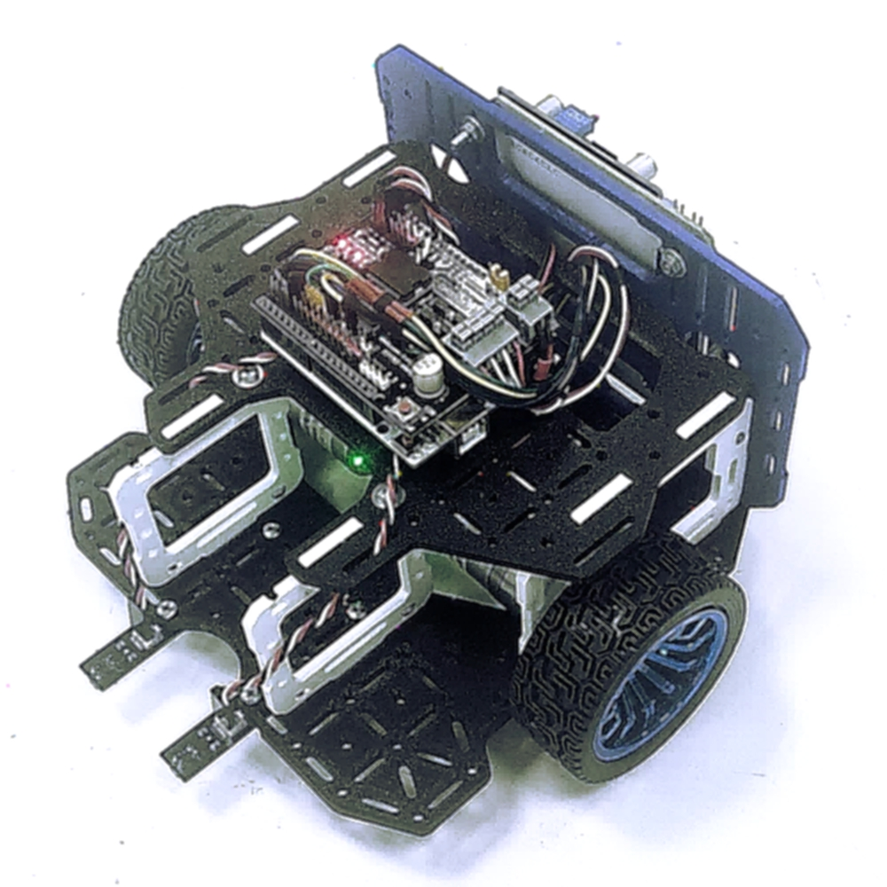

# [MidiQ Всош v2](.)

[Выпуск от 2025.09.20](.) [`zip`](./../MidiQ-Всош-v2--2025.09.20.zip) [`step`](MidiQ-Всош-v2.stp)

<table>
<tr valign="top">
<td>

</td>
<td>
 
 
</td>
</tr>
</table>
    

# Детали

<blockquote>

## Платформа - 1 шт.

<table>
<tr valign="top">
<td></td>
<td></td>
</tr>
</table>

[`.stp`](1x--Платформа-v1.stp) [`.dxf`](1x--Платформа-v1.dxf) [`.3mf (PrusaSlicer)`](1x--Платформа-v1.prusa.3mf)

</blockquote>

<blockquote>

## Стенка Боковая - 2 шт.

<table>
<tr valign="top">
<td></td>
<td></td>
</tr>
</table>

[`.stp`](2x--Стенка-Боковая-v1.stp) [`.dxf`](2x--Стенка-Боковая-v1.dxf)

</blockquote>

<blockquote>

## Стенка Верхняя - 1 шт.

<table>
<tr valign="top">
<td></td>
<td></td>
</tr>
</table>

[`.stp`](1x--Стенка-Верхняя-v1.stp) [`.dxf`](1x--Стенка-Верхняя-v1.dxf)

</blockquote>

<blockquote>

## Стенка Задняя - 1 шт.

<table>
<tr valign="top">
<td></td>
<td></td>
</tr>
</table>

[`.stp`](1x--Стенка-Задняя-v2.stp) [`.dxf`](1x--Стенка-Задняя-v2.dxf) [`.3mf (PrusaSlicer)`](1x--Стенка-Задняя-v2.prusa.3mf)

</blockquote>

<blockquote>

## Рамка - 2 шт.

<table>
<tr valign="top">
<td></td>
<td></td>
</tr>
</table>

[`.stp`](2x--Рамка-v4.stp) [`.dxf`](2x--Рамка-v4.dxf) [`.3mf (PrusaSlicer)`](2x--Рамка-v4.prusa.3mf)

</blockquote>

---

Файл сгенерирован инструментами проекта.

[LICENCE](https://github.com/KiraFlux/Botix/blob/main/LICENSE)

